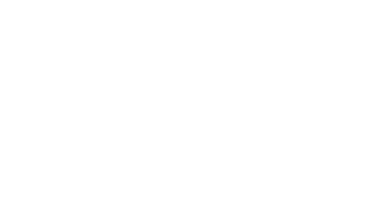

<p align="center">
    
</p>
<h1 align="center">:pushpin: GuessTheWord - Adivinhe as Palavras <h1>


<p align="center">


</p>


## :bookmark: Sobre


<p align="center">
    Aplicativo desenvolvido como trabalho final da disciplina de Linguagens de Programação, ministrada pelo <strong>Professor Doutor Marcos Silvano Almeida</strong>  na  <strong>Universidade Tecnologia Federal do Paraná</strong> (UTFPR/CM).
</p>

<br>

# :computer: Screenshots

## :small_red_triangle_down: Tela inicial


<p align="center">
    
</p>

<p  align="center">Tela onde usuário digitará <i>nickname</i> utilizado na rodada.</p>


## :small_red_triangle_down: Aguardando players


<p align="center">
    
</p>


<p  align="center">Tela inicial do jogo, onde os players aguardaram a quantidade mínima de jogadores para iniciar a partida.</p>

## :small_red_triangle_down: Informando dados da rodada


<p align="center">
    
</p>

<p  align="center">Tela onde o jogador da vez informará o tema, dica e resposta da rodada.</p>


## :small_red_triangle_down: Passou perto


<p align="center">
    
</p>

<p align="center">Caso jogador digite uma palavra parecida com a resposta, aparecerá uma dica para o mesmo (Mensagem que informa que o usuário quase acertou a palavra).</p>


## :small_red_triangle_down: Ranking


<p align="center">
    
</p>

<p align="center">Tela final do jogo, onde ficará disposto o ranking dos jogadores.</p>


## 🚀 Tecnologias

- [Python](https://www.python.org/)
- [Socket-io](https://socket.io/)
- [Flutter](https://flutter.dev/)
- [Conda](https://docs.conda.io/en/latest/)

## ❓ Como inicializar o aplicativo flutter?

```bash
$ cd trivia_game
$ cd flutter
$ flutter run
```

## ❓ Como inicializar o servidor Python do aplicativo?

```bash
$ cd trivia_game
$ cd python
$ conda create --name trivia --file requirements.txt
$ conda activate trivia
$ python app.py
```

## :octocat: Como contribuir?

```bash
$ git clone git@github.com:jhonatancunha/trivia_game.git
$ git checkout -b contribution-branch
$ git commit -m "My changes"
$ git push origin contribution-branch
```


### :mortar_board: Autores

<table><tr>
<td align="center"><a href="https://github.com/jhonatancunha">
 
<br />
 <b>Jhonatan Cunha</b></a>
 <a href="https://github.com/jhonatancunha" title="Repositorio Jhonatan"></a>

[](mailto:jhonatancunha@alunos.utfpr.edu.br)</td>

<td align="center"><a href="https://github.com/JessePires">
 
<br />
 <b>Jessé Pires</b>
 </a> <a href="https://github.com/JessePires" title="Repositorio Jessé"></a>

[](mailto:jesserocha@alunos.utfpr.edu.br)</td>
</tr></table>

<p align="center">
Made with :coffee: by :copyright: Jhonatan Cunha and Jessé Pires.
</p>

<!-- ## :memo: Licença
[MIT](https://choosealicense.com/licenses/mit/) -->